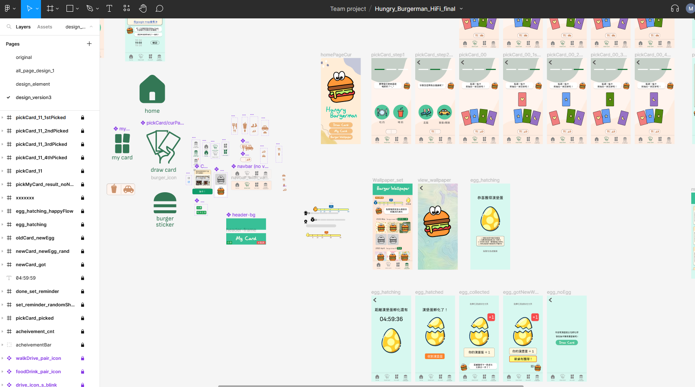

# Hungry Burgerman

## Introduction

Welcome to Hungry Burgerman, a coursework project developed for CS2410 Software Studio at National Tsinghua University.

This project is a collaborative effort by a team of three groupmates, w The objective is to design a mobile app aimed at addressing issues we've identified among our fellow schoolmates.

## Goal of the app

This app is designed to assist individuals facing difficulties in making food choices. 

The app simplifies the decision-making process. Users simply need to choose whether they want to select a restaurant or a beverage shop, and specify the desired distance range. The app will then randomly recommend a shop, powered by the Google Maps API.

As an added incentive, by picking a shop, users have the opportunity to collect a mobile wallpaper featuring the app's mascot, Burgerman.

## Techniques Employed

- Architecture of the app built on Expo and React Native
- Routers for navigating between screens
- UI by React Native StyleSheet
- DOM event handling

## Demo Video

https://youtu.be/NxFXweULE2A

## Screenshots

## UI Prototype

Protype in Figma: https://www.figma.com/proto/izfQawMho7GrdKQtls4Ns3/Hungry_Burgerman_HiFi_final?type=design&node-id=327-3359&scaling=scale-down&page-id=46%3A583&starting-point-node-id=327%3A3359

